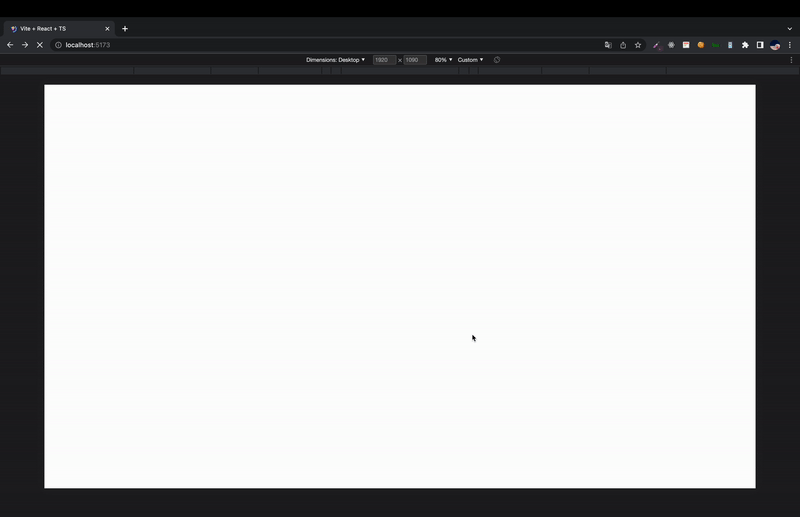

# react-image-preload

## Introduction

React 이미지 캐싱



## Get Started

아직 npm 배포 X

## Type

여기서는 다음과 같은 형식을 사용합니다.

```typescript
interface IImagePreloader {
  imagePaths?: string[];
  imageUrls?: string[];
  fallback?: React.ReactElement;
  indicator?: React.ReactElement;
}
```

## Usage

```React
import { Outlet } from 'react-router-dom';
import { ImagePreloader } from 'react-image-preload';

import './App.css';

import img7 from './assets/images/react7.svg';
import img6 from './assets/images/react6.svg';
import img5 from './assets/images/react5.svg';
import img4 from './assets/images/react4.svg';
import img3 from './assets/images/react3.svg';
import img2 from './assets/images/react2.svg';
import img1 from './assets/images/react.svg';

const Root = () => {
  const imgs = [img1, img2, img3, img4, img5, img6, img7];
  return (
    <>
      <Outlet />
      <ImagePreloader
        imagePaths={imgs}
        fallback={<span>Loading!!!</span>}
        indicator={<span>Done</span>}
      />
    </>
  );
};
```
